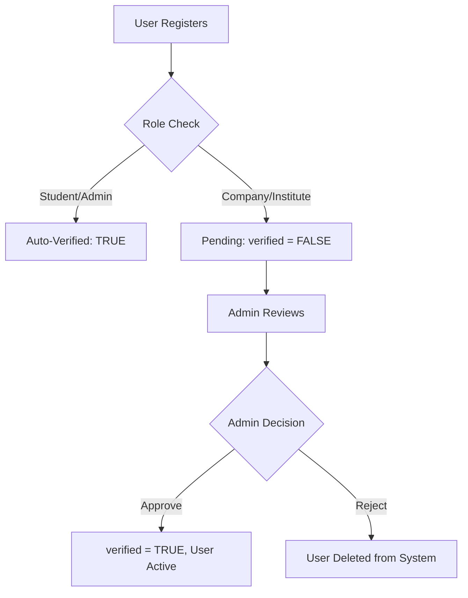

# Admin Dashboard - Complete Documentation

## 🎯 Overview

The Admin Dashboard is a comprehensive management interface for platform administrators to:
- **Verify** and approve new company and institute registrations
- **Monitor** platform analytics and statistics
- **Manage** users across all roles (Students, Companies, Institutes)
- **Track** system performance and activity

---

## 🌟 Key Features

### 1. **Verification System**
Approve or reject new company and institute registrations with a streamlined workflow.

**Features:**
- ✅ View pending registrations in real-time
- ✅ Filter by role (Company, Institute, Student)
- ✅ Search by name, email, or organization
- ✅ One-click approve/reject actions
- ✅ Detailed user information display
- ✅ Registration date tracking

**Workflow:**
1. New companies/institutes register → Status: "Pending"
2. Admin reviews application details
3. Admin approves → User gets full access
4. Admin rejects → User account is removed

### 2. **Analytics Dashboard**
Comprehensive statistics and insights into platform performance.

**Metrics Displayed:**
- 📊 Total Students
- 🏢 Total Companies
- 🎓 Total Institutes
- 📜 Certificates Issued
- ⏳ Pending Verifications
- 👥 Active Users

**Trends:**
- Month-over-month growth percentages
- Visual indicators for positive trends
- Real-time data updates

### 3. **Navigation Sidebar**
Easy-to-use sidebar with organized sections.

**Sections:**
1. **Dashboard** - Overview and statistics
2. **Verifications** - Pending user approvals (with badge count)
3. **Students** - Student management
4. **Companies** - Company management
5. **Institutes** - Institute management
6. **Analytics** - Detailed insights and charts
7. **Settings** - System configuration

---

## 🎨 Design Features

### Visual Styling
- **Modern glassmorphism** design
- **Gradient backgrounds** (Purple to Violet)
- **Smooth animations** and transitions
- **Responsive layout** for all screen sizes
- **Color-coded stat cards** for easy recognition

### User Experience
- **Intuitive navigation** with active state indicators
- **Quick actions** for common tasks
- **Real-time badge notifications** for pending items
- **Hover effects** for interactive elements
- **Empty states** with helpful messages

---

## 📊 Statistics Cards

### Color Coding
- **Students** - Purple gradient
- **Companies** - Pink-Red gradient
- **Institutes** - Blue-Cyan gradient
- **Certificates** - Green-Teal gradient
- **Pending** - Pink-Yellow gradient
- **Active Users** - Cyan-Purple gradient

### Information Displayed
- Large number (main stat)
- Label description
- Growth trend with percentage
- Visual icon representation

---

## 🔐 API Endpoints

### Get Dashboard Stats
```http
GET /api/admin/stats
Authorization: Bearer <admin_token>
```

**Response:**
```json
{
  "stats": {
    "totalStudents": 150,
    "totalCompanies": 25,
    "totalInstitutes": 10,
    "totalCertificates": 5,
    "pendingVerifications": 8,
    "activeUsers": 180
  }
}
```

### Get Pending Users
```http
GET /api/admin/pending-users
Authorization: Bearer <admin_token>
```

**Response:**
```json
[
  {
    "id": 123,
    "email": "institute@example.com",
    "role": "Institute",
    "full_name": "ABC Institute",
    "organization": "ABC Technical Institute",
    "phone": "+1234567890",
    "created_at": "2025-10-03T10:30:00Z",
    "verified": false
  }
]
```

### Approve User
```http
POST /api/admin/approve-user/:id
Authorization: Bearer <admin_token>
```

**Response:**
```json
{
  "success": true,
  "message": "User approved successfully"
}
```

### Reject User
```http
POST /api/admin/reject-user/:id
Authorization: Bearer <admin_token>
```

**Response:**
```json
{
  "success": true,
  "message": "User rejected and removed from system"
}
```

---

## 🗄️ Database Schema

### Users Table (Updated)

```sql
CREATE TABLE users (
  id SERIAL PRIMARY KEY,
  email VARCHAR(255) UNIQUE NOT NULL,
  password VARCHAR(255) NOT NULL,
  role VARCHAR(50) NOT NULL CHECK (role IN ('Admin', 'Institute', 'Student', 'Company')),
  full_name VARCHAR(255),
  organization VARCHAR(255),
  phone VARCHAR(50),
  verified BOOLEAN DEFAULT TRUE,          -- NEW FIELD
  created_at TIMESTAMP DEFAULT CURRENT_TIMESTAMP,
  updated_at TIMESTAMP DEFAULT CURRENT_TIMESTAMP
);
```

**Key Fields:**
- `verified`: Boolean flag for approval status
  - `FALSE` - Pending verification (Companies & Institutes)
  - `TRUE` - Approved and active (All users)
  - Admins and Students: Auto-verified on registration
  - Companies and Institutes: Require admin approval

---

## 🔄 Verification Workflow

### Registration Flow



### Code Implementation

**Frontend (AdminDashboard.js):**
```javascript
const handleApproveUser = async (userId) => {
  await axios.post(`/api/admin/approve-user/${userId}`);
  fetchDashboardData(); // Refresh
};

const handleRejectUser = async (userId) => {
  await axios.post(`/api/admin/reject-user/${userId}`);
  fetchDashboardData(); // Refresh
};
```

**Backend (admin.js):**
```javascript
// Approve
router.post('/approve-user/:id', async (req, res) => {
  await pool.query('UPDATE users SET verified = TRUE WHERE id = $1', [id]);
});

// Reject
router.post('/reject-user/:id', async (req, res) => {
  await pool.query('DELETE FROM users WHERE id = $1', [id]);
});
```

---

## 🎯 Features by Section

### Dashboard Section
- **Overview stats** with 6 key metrics
- **Quick action buttons** for common tasks
- **Pending verification** count with quick link
- **Growth trends** for all metrics

### Verifications Section
- **Table view** of all pending users
- **User avatars** with initials
- **Contact information** display
- **Registration dates**
- **Role badges** (color-coded)
- **Action buttons** (View, Approve, Reject)
- **Search functionality** across all fields
- **Filter by role** dropdown
- **Export** button for data download

### Analytics Section
- **Chart placeholders** for future integration
- **User growth trends**
- **Certificate distribution**
- **Platform activity** metrics
- **Verification success rates**

---

## 🚀 Usage Instructions

### For Administrators

#### Accessing the Dashboard
1. Login with Admin credentials
2. Navigate to `/admin/dashboard`
3. Dashboard loads with real-time stats

#### Reviewing Pending Users
1. Click **"Verifications"** in sidebar
2. View list of pending registrations
3. Use search/filter to find specific users
4. Review user details (name, email, org, phone)

#### Approving a User
1. Click **"Approve"** button for the user
2. Confirmation: "User approved successfully"
3. User's `verified` status changes to `TRUE`
4. User gains full platform access
5. User removed from pending list

#### Rejecting a User
1. Click **"Reject"** button for the user
2. Confirm rejection in popup dialog
3. User account is permanently deleted
4. User removed from database

#### Viewing Analytics
1. Click **"Analytics"** in sidebar
2. View comprehensive statistics
3. Analyze trends and patterns
4. Generate reports (coming soon)

---

## 🎨 Styling Guide

### Color Palette
```css
--primary: #667eea (Purple)
--secondary: #764ba2 (Violet)
--success: #10b981 (Green)
--danger: #ef4444 (Red)
--warning: #fa709a (Pink)
--info: #4facfe (Blue)
```

### Typography
- **Font**: Inter, SF Pro, System UI
- **Headings**: 700 weight
- **Body**: 500 weight
- **Small text**: 400 weight

### Spacing
- **Card padding**: 28-32px
- **Gap between elements**: 16-24px
- **Border radius**: 12-20px

---

## 🔒 Security

### Authentication
- All endpoints require **JWT token**
- Role-based authorization (Admin only)
- Token passed in Authorization header

### Authorization Checks
```javascript
router.get('/admin/stats', 
  authenticateToken,           // Verify JWT
  authorizeRole('Admin'),      // Check Admin role
  async (req, res) => { ... }
);
```

### Data Protection
- **Passwords**: Never exposed in API responses
- **User data**: Filtered before sending to frontend
- **Admin actions**: Logged for audit trail

---

## 📱 Responsive Design

### Breakpoints
- **Desktop**: 1024px+
- **Tablet**: 768px - 1024px
- **Mobile**: < 768px

### Mobile Adaptations
- Sidebar becomes horizontal tabs
- Stats grid becomes single column
- Table becomes stacked cards
- Filters stack vertically
- Action buttons full width

---

## 🔮 Future Enhancements

### Planned Features
1. **Advanced Analytics**
   - Interactive charts (Chart.js/Recharts)
   - Date range filters
   - Export reports to PDF/CSV

2. **Email Notifications**
   - Auto-email on approval/rejection
   - Weekly admin digest
   - User activity alerts

3. **Batch Operations**
   - Approve/reject multiple users
   - Bulk export functionality
   - Mass email communication

4. **User Activity Logs**
   - Track user actions
   - Login history
   - Certificate issuance timeline

5. **System Settings**
   - Platform configuration
   - Email templates
   - Verification rules
   - Auto-approval criteria

---

## 🐛 Troubleshooting

### Common Issues

**Issue**: Pending users not showing
- **Solution**: Check database for `verified = FALSE` records
- **Check**: PostgreSQL connection status

**Issue**: Approve button not working
- **Solution**: Verify JWT token is valid
- **Check**: Backend logs for error messages

**Issue**: Stats showing zero
- **Solution**: Ensure `/api/admin/stats` endpoint is working
- **Check**: Database has data

**Issue**: Search not filtering
- **Solution**: Clear search term and try again
- **Check**: Case sensitivity in search logic

---

## 📖 Component Structure

```
AdminDashboard.js
├── renderSidebar()
│   ├── Sidebar Header
│   ├── Navigation Items (with active states)
│   └── Admin Info Footer
│
├── renderDashboard()
│   ├── Stats Grid (6 cards)
│   └── Quick Actions
│
├── renderVerifications()
│   ├── Search & Filters
│   ├── Verifications Table
│   │   ├── User Details Column
│   │   ├── Role Badge
│   │   ├── Organization
│   │   ├── Date
│   │   ├── Status Badge
│   │   └── Action Buttons
│   └── Empty State (if no pending)
│
└── renderAnalytics()
    └── Analytics Cards Grid
```

---

## 🎓 Summary

The Admin Dashboard provides a **comprehensive, user-friendly interface** for platform administration with:

✅ **Real-time verification** of company and institute registrations
✅ **Detailed analytics** and platform statistics  
✅ **Intuitive navigation** with organized sections
✅ **Modern, responsive design** with smooth animations
✅ **Secure API endpoints** with role-based authorization
✅ **Database integration** with dual storage support

**Status**: ✅ Fully Functional
**Access**: Admin users only
**Performance**: Real-time data updates

---

## 📞 Support

For questions or issues:
1. Check this documentation
2. Review backend logs for API errors
3. Test endpoints with Postman
4. Verify database schema matches specs
5. Check browser console for frontend errors

**The Admin Dashboard is production-ready!** 🚀
